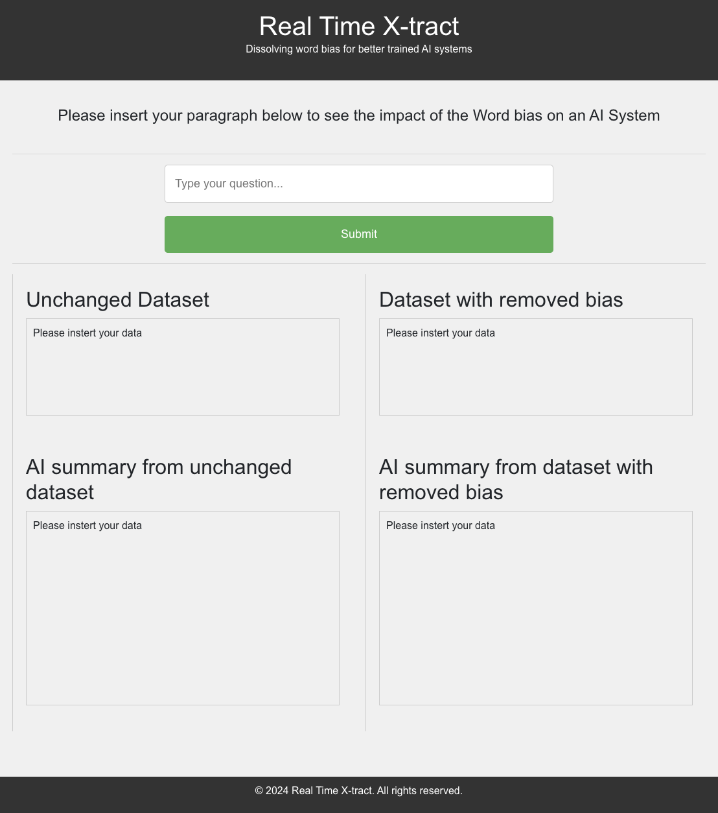

- Developed a full-stack application to remove word bias from datasets, generating factual, unskewed information.
- Implemented a PyTorch-based algorithm leveraging BERT to tokenize and filter relevant terms, integrating with Google Gemini’s API for output comparison and bias impact analysis.

The Backend is Fast API and not Node. There is a node file, so if you run npm start,
it will work because there is a connected node backend, but instead run
uvicorn app:app --reload.

You can use npm start for the frontend.

